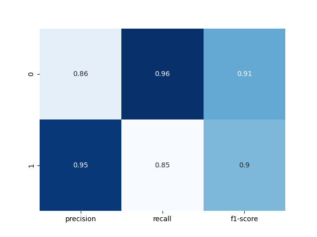

# Logistic Regression: Predicting Advertisement Clicks

Built a logistic regression model to predict whether a user will click on an online advertisement using demographic and usage-based features.

---

## Project Overview
In this project, I developed a binary classification model to predict ad click behaviour using features such as age, area income, daily internet usage, and time spent on the site. The model achieved approximately **90% accuracy** on a held-out test set.

---

## Exploratory Data Analysis
Before modelling, I explored the dataset to understand user behaviour and feature relationships.

### 1. Age Distribution
  
Visualised the age distribution of users, with most observations falling between 25 and 45 years old.

### 2. Area Income vs. Age
  
Examined the relationship between age and area-level income to identify potential trends in ad engagement.

### 3. Usage Intensity
  
Used a kernel density plot to analyse how daily internet usage and time spent on the site differ between users.

---

## Logistic Regression Model
A logistic regression classifier was trained to predict whether a user clicked on an advertisement.

### 4. Multivariate Feature Relationships
  
Created a pairplot coloured by the target variable to examine how features interact. Daily internet usage and time spent on the site showed the clearest separation between clickers and non-clickers.

### Model Performance
The model was evaluated using a 33% test split.



- **Precision (Click = 1): 0.95** — When the model predicts a click, it is correct 95% of the time.
- **Recall (Click = 1): 0.85** — The model identifies 85% of actual clicks.
- **F1-score: 0.90** — Indicates a good balance between precision and recall.

---

## Key Takeaways
- Users with very high daily internet usage were less likely to click on ads, suggesting lower engagement among heavy users.
- Age and daily internet usage were the most influential features in predicting click behaviour.
- The model is well suited for applications where precision is important, such as cost-sensitive advertising.

---

## How to Run
```bash
pip install pandas seaborn scikit-learn
jupyter notebook "Logistic Regression Project.ipynb"

jupyter notebook "Logistic Regression Project.ipynb"
