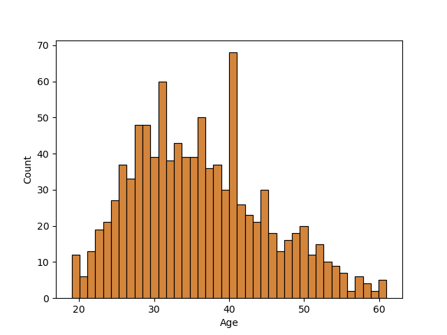
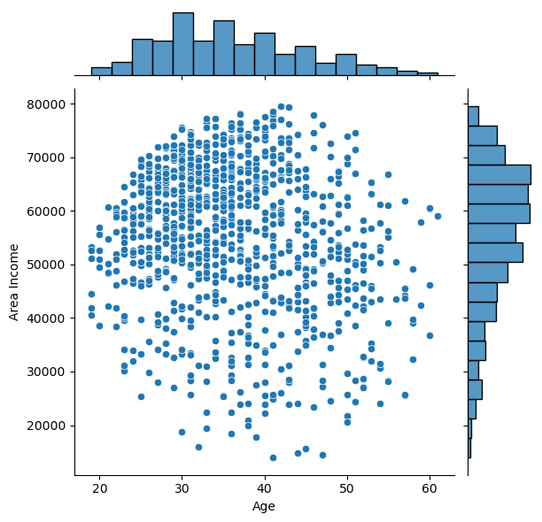
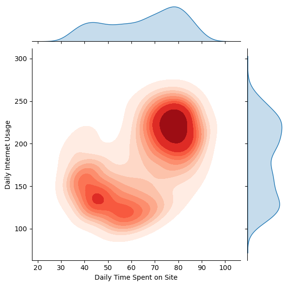
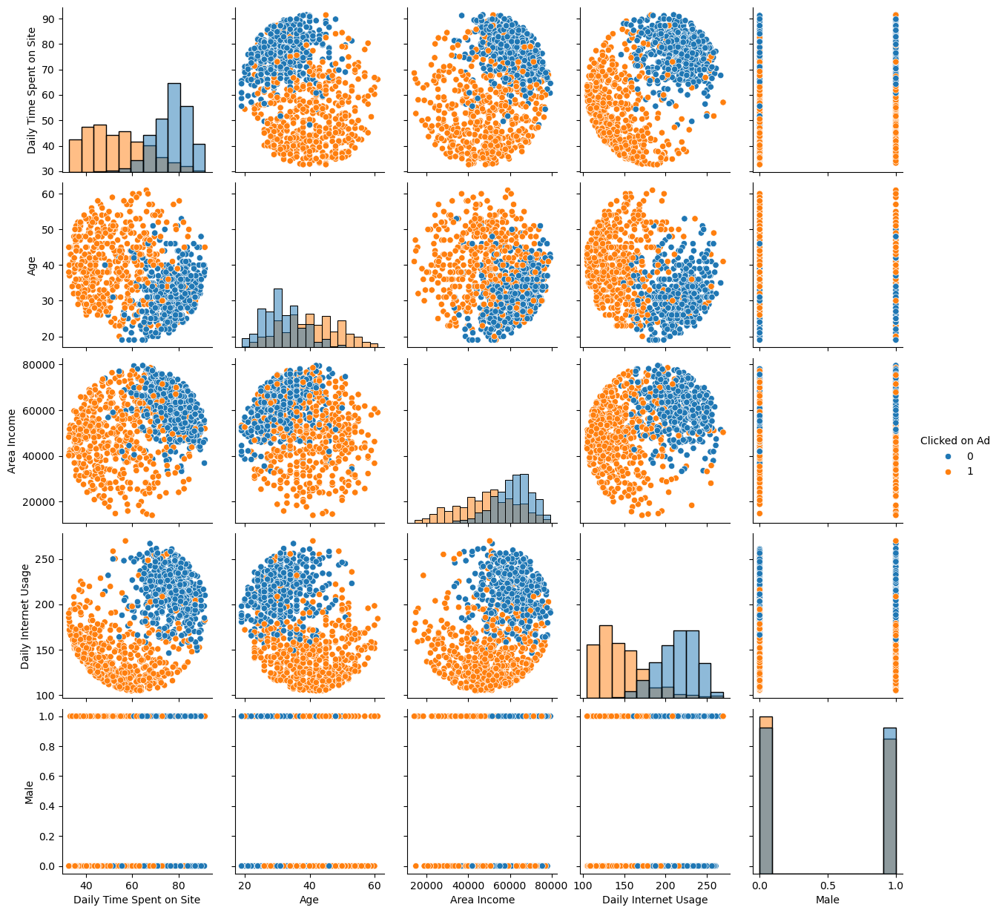

# Logistic Regression: Predicting Consumer Advertisement Clicks

A predictive analysis using demographic and behavioral data to determine the likelihood of a user clicking on an internet advertisement.

---

## Project Overview
In this project, I developed a classification model to predict user engagement with online ads. By analyzing features such as age, income, and browsing habits, I identified the key indicators that distinguish "clickers" from "non-clickers," achieving a **90% model accuracy**.

---

## Exploratory Data Analysis
Before modeling, I explored the dataset to find clusters and correlations in user behavior.

### 1. Age Distribution
  
Visualized the age range of the target audience. Most users in the dataset fall between 25 and 45 years old, providing a clear target demographic for the campaign.

### 2. Area Income vs. Age
  
Analyzed the relationship between geography-based income and age to see if higher-income areas showed different engagement patterns.

### 3. Usage Intensity (KDE)
  
Used a Kernel Density Estimate (KDE) plot to visualize the density of "Time Spent on Site" vs. "Daily Internet Usage." This revealed distinct behavioral clusters among users.

---

## Logistic Regression Modeling
I implemented a Logistic Regression classifier to handle the binary prediction task.

### 4. Multivariate Analysis (Pairplot)
  
Created a comprehensive pairplot colored by the target variable. This visualization clearly shows that clickers are separated significantly by their **Daily Internet Usage** and **Daily Time Spent on Site**, which served as the strongest predictors for the model.

### Model Performance Metrics
The model was evaluated using a 33% test split, yielding the following results:
* **Precision (Class 1):** 0.95 — When the model predicts a click, it is correct 95% of the time.
* **Recall (Class 1):** 0.85 — The model successfully identified 85% of all actual clickers.
* **F1-Score:** 0.90 — Demonstrating a high balance between accuracy and reliability.

---

## Key Takeaways
* **The "Efficiency" Paradox**: Users who spend the *most* time on the internet daily are actually *less* likely to click on ads, suggesting a higher level of "ad-blindness" in high-usage groups.
* **Strongest Predictors**: Age and Daily Internet Usage were the most statistically significant features in determining click probability.
* **Business Application**: With a 95% Precision rate, this model is highly effective for cost-sensitive ad campaigns where avoiding "wasted" impressions is critical.

---

## How to Run
```bash
pip install pandas seaborn scikit-learn
jupyter notebook "Logistic Regression Project.ipynb"
